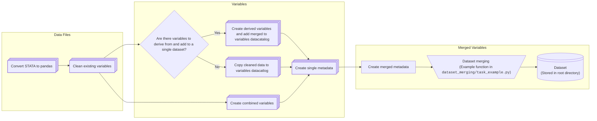

# SOEP data preparation for use with research projects

[](https://github.com/felixschmitz/soep_preparation/actions?query=branch%3Amain)
[](https://codecov.io/gh/felixschmitz/soep_preparation)

[](https://results.pre-commit.ci/latest/github/felixschmitz/soep_preparation/main)
[](https://github.com/psf/black)

## Project Overview

The project focusses on casting variables to adequate data types, manipulating them in
further ways (e.g. by sensibly filling missing values or reducing the number of
categories), combines them where relevant to new variables (e.g. bmi dummy from
continuous medical variables), and selects them for the creation of a final output
dataset. The flow of the project can be seen in the mermaid diagram below.



This project processes the SOEP-Core data for use with research projects. The examples
are geared towards using the data with
[GETTSIM](https://gettsim.readthedocs.io/en/stable/). The raw data is provided by the
German Institute for Economic Research (DIW Berlin) and is a panel dataset that follows
the same individuals over time. The data is collected annually and contains information
on various topics such as income, employment, and health. The data is available for
scientific use, for more information visit the
[Research Data Center SOEP](https://www.diw.de/en/diw_01.c.678568.en/research_data_center_soep.html).

The top-level directory is structured as follows:

- `data`: raw data in `.dta` format with directories for each version (e.g. `V38`)
- `src`: source code with tasks for preparing the raw data
- `tests`: tests of the source code
- other files include the processed output dataset (will be created automatically), the
  environment configuration, pre-commit hooks, and some meta-files like this README

## Usage

To get started, install [pixi](https://prefix.dev/docs/pixi/overview#installation) if
you haven't already.

**_Inside the directory `soep_preparation/data` place the folder `V38` containing the
raw `.dta` datafiles._**

To build the project, type

```console
$ pixi run pytask
```

If all tasks run, the file `example_merged_dataset.pickle` is created in the root
directory.

## Working with the Data and Modules

The SOEP data is available in different waves, with the latest being version 39. This
project is currently set up to work with version 38. It is relevant to note that the
SOEP is a survey, which usually asks questions regarding variables in the previous
calendar year (e.g. "What was your annual income _last year_?").

### Terminology

One wave consists of different survey *modules*. Each of these is distributed by the
SOEP team as one *raw data file*. For example `hwealth.dta` contains the wealth
information on household level. One of the "variables" in the dataset is `p010ha`
describing the market value of primary residence (see
https://paneldata.org/soep-core/datasets/hwealth/p010ha).

After converting the "raw data file" from STATA `.dta` format to a pandas DataFrame, the
variables inside the module are cleaned. Further, variables from multiple cleaned
modules containing the same information are combined into a new module.

The final returned variables merged into one table is called a "dataset". We try to
follow this syntax as close as possible.

### Understanding the SOEP-Core Data

To understand the related raw SOEP variable(s) and applied conversions of a variable
provided by this package, have a look at the corresponding script in the directory
`src/soep_preparation/raw_data/`, e.g. the variable `number_of_children` can be found in
this manner in the script `biobirth.py` depending on the SOEP-variable `sumkids`. To
further understand the content of `sumkids`, the
[documentation of the SOEP variable](https://paneldata.org/soep-core/datasets/biobirth/sumkids),
especially the "Codebook (PDF)", is helpful. The SOEP documentation URL for a dataset
and variable has the general form:
`https://paneldata.org/soep-core/datasets/{dataset_name}/{variable_name}`

To understand which variables are additionally available for a dataset, the URL
`https://paneldata.org/soep-core/datasets/{dataset_name}` might be helpful. Here you can
search for variable names within this file.

### Creating your own Merged Dataset

The directory `src/soep_preparation/dataset_merging` contains two modules. Inside
`helper.py` you can find the function `create_dataset_from_variables`. The function
takes most importantly a list of `variables` and survey years you are interested in. The
survey years can be either passed to the function as a tuple characterizing the min and
max survey years (e.g. `min_and_max_survey_years=(2020, 2025)`) or all the survey years
(e.g. `survey_years=[2020, 2021, 2022, 2023, 2024, 2025]`). Further the argument
`variable_to_file_mapping` is generated by the tasks and contains the meta information
for the variables of interest and their corresponding prepared data. See the example for
the correct specification for the function call of `create_dataset_from_variables`.

Further, there is `task_example.py` which contains an example on how to write your own
task to merge `variables` of interest for a range of `survey_year`'s to a dataset using
the helper module. Other components of the merging process are handled via the
implemented helper functions. Do not include any of the ID variables (`survey_year`,
`hh_id`, `hh_orig_id`, `p_id`) in the columns list, as these are automatically included.

### Advanced: Additional Variables from an Existing Dataset

If you want to include an additional variable from a dataset that is already being
cleaned, follow this approach:

Each new variable should be created by processing a column (or several columns) from the
raw data. The results of this processing will then be added to the final dataset that
the system builds.

Here’s how you can do that:

1. Identify the raw variable you want to transform or clean from your input data.

1. Use or create a function that transforms this raw variable into the final form you
   need.

1. Assign the result of that transformation to the out DataFrame, which represents your
   cleaned dataset.

Suppose you want to add a new variable, `age`, to your final dataset based on the `raw`
data. Here’s how the process would look:

```python
def clean(raw: pd.DataFrame) -> pd.DataFrame:
    out = pd.DataFrame()

    # Example: Adding a variable 'age' after processing the 'birth_year' column
    out["age"] = calculate_age_from_birth_year(raw["birth_year"])

    return out
```

### Advanced: Creating Derived Variables from Multiple Data Sources

See the modules `household.py` and `personal.py` in the directory
`src/soep_preparation/combine_modules` for functions creating new variables from data
sources. Inside `ppathl_bioedu.py` the function `combine` takes as arguments the cleaned
data `ppathl` and `bioedu`, both contain a `birth_month_from_` variable. The function
returns a DataFrame with an unique `birth_month` variable.

You can do so similarly by either creating your own function to derive a certain
variable or by adding your variable to an existing function.

### Advanced: Adding a New Module

To add a new SOEP-Core module to the project, follow these steps:

1. Add the raw data file to the data directory

   Each raw data file should be placed in the appropriate data directory (e.g., inside
   `soep_preparation/data/V38`). As an example, say you want to add the module
   `pequiv.dta` (this is already present in the pipeline).

1. Create a corresponding python script

   For each new module, create a corresponding python script (here: `pequiv.py`) inside
   the directory `soep_preparation/clean_modules`. Each module must include a clean
   function that takes a `pd.DataFrame` as input and returns the cleaned dataset, also
   as a `pd.DataFrame`.

   Example template for the clean function:

   ```python
   import pandas as pd
   from soep_preparation.utilities.data_manipulator import cleaning_function


   def clean(raw: pd.DataFrame) -> pd.DataFrame:
       """Create cleaned variables with sensible data type from the raw pequiv module."""
       out = pd.DataFrame()

       # Apply cleaning steps to raw data
       out["hh_id_orig"] = cleaning_function(raw["cid"])

       return out
   ```

## Further Structure Description

**_Inside `data` place the folder `V38` containing all `.dta` files to be cleaned and
processed._**

The `src/soep_preparation` directory contains the subdirectories
`convert_stata_to_pandas`, `clean_modules`, `combine_modules`, `create_metadata`,
`dataset_merging` and `utilities`. Further the script `config.py`.

Inside `convert_stata_to_pandas`, the raw data files are read and converted to pandas
DataFrames. The scripts in the `clean_modules` directory follow the rules of functional
data management using pandas, to select variables, manipulate them and apply sensible
data types for each module. For an introduction see here:
https://effective-programming-practices.vercel.app/pandas/index.html Inside the
`task.py`, the module-specific script is loaded and executed with corresponding raw
data. The usual implementation of cleaning a column is:

```python
out["new_name"] = cleaning_function(raw["old_name"])
```

where `out` is the dataset created from the bottom up with the results from
`cleaning_function()`. The latter takes a `pd.Series` as argument (sometimes additional,
but optional inputs) and returns the cleaned series as `pd.Series`. `raw` is the data
currently being cleaned.

Further, inside `combine_modules`, scripts combine variables with the same information
from multiple modules. This might happen for variables from monthly diary notes and the
annual questionnaire. We call the result also a *module*.

For each module in `clean_modules` and `combine_modules`, we create metadata information
in `create_metadata` and map variables to their metadata and corresponding module name.
By this, the user can easily check in
`src/soep_preparation/create_metadata/variable_to_metadata_mapping.yaml` which variables
are available and where to access them. This is useful for merging any combination into
a final dataset. The `dataset_merging` directory contains the script for merging the
final dataset. `utilities/` contains scripts with general helper functions.

The `config.py` specifies global constants.

## Credits

This project was created with [cookiecutter](https://github.com/audreyr/cookiecutter)
and the
[econ-project-templates](https://github.com/OpenSourceEconomics/econ-project-templates).
