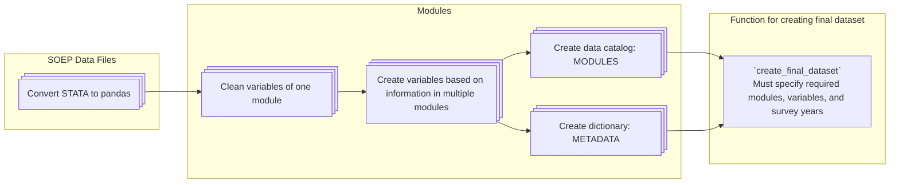

# SOEP data preparation for use with research projects

[](https://github.com/felixschmitz/soep_preparation/actions?query=branch%3Amain)
[](https://codecov.io/gh/felixschmitz/soep_preparation)

[](https://results.pre-commit.ci/latest/github/felixschmitz/soep_preparation/main)
[](https://github.com/psf/black)

## Project Overview

The project focusses on casting variables to adequate data types, manipulating them in
further ways (e.g. by sensibly filling missing values or reducing the number of
categories), combines them where relevant to new variables (e.g. bmi dummy from
continuous medical variables), and selects them for the creation of a final output
dataset. The flow of the project can be seen in the mermaid diagram below.



This project processes the SOEP-Core data for use with research projects. The examples
are geared towards using the data with
[GETTSIM](https://gettsim.readthedocs.io/en/stable/). The raw data is provided by the
German Institute for Economic Research (DIW Berlin) and is a panel dataset that follows
the same individuals over time. See the
[Research Data Center SOEP](https://www.diw.de/en/diw_01.c.678568.en/research_data_center_soep.html).

The top-level directory is structured as follows:

- `data`: raw data in `.dta` format with directories for each version (e.g. `V40`)
- `src`: source code with tasks for preparing the raw data
- `tests`: tests of the source code
- other files include the processed output dataset (will be created automatically), the
  environment configuration, pre-commit hooks, and some meta information like this
  README

## Usage

To get started, install [pixi](https://prefix.dev/docs/pixi/overview#installation) if
you do not have it on your machine already.

**_Inside the directory `soep_preparation/data` fill the folder `V40` containing the raw
`.dta` data files downloaded from the SOEP website._**

To build the project, type

```console
$ pixi run pytask
```

If all tasks run successfully, the file `example_merged_dataset.pickle` is created in
the root directory.

## Working with the Data and Modules

The SOEP data is available in different versions, the latest being version 40. This
project is currently set up to work with version 38. It is relevant to note that the
SOEP is a survey, which often asks questions about the previous calendar year (e.g.
"What was your annual income _last year_?").

### Terminology

One survey wave consists of different survey *modules*. Each of these is distributed by
the SOEP team as one *raw data file*. For example `hwealth.dta` contains the wealth
information on the household level. One of the *variables* in the module is `p010ha`
describing the market value of primary residence (see
https://paneldata.org/soep-core/datasets/hwealth/p010ha).

After converting the *raw data file* from STATA `.dta` format to a pandas DataFrame, the
variables inside the module are cleaned. This may contain (some or all of) the index
variables: `p_id`, `hh_id`, `hh_id_original`, and `survey_year` These are helpful to
align modules to merge into the `final_dataset`.

In another step, variables from multiple modules are combined into a new module, which
always carries a name of the form `{module_1}_{module_2}` (e.g., `pl_pkal`)

The final step consists of merging the variables into the *final dataset*. This will be
done by the user; this project provides a helper function to do so.

### Creating your own Merged Dataset

Here is an example for creating a SOEP final dataset in a project (for execution place
the code below into a script called e.g. `task_create_final_dataset` inside the
`src/soep_preparation/` directory):

```python
from pathlib import Path
from typing import Annotated

import pandas as pd

from soep_preparation.config import MODULES
from soep_preparation.final_dataset import create_final_dataset


def task_create_soep_dataset(
    variables: Annotated[list[str], ["birth_year", "bmi"]],
    survey_years: Annotated[list[int], [1988, 1990, 1992, 1994]],
    pbrutto: Annotated[pd.DataFrame, MODULES["pbrutto"]],
    pl_pequiv: Annotated[pd.DataFrame, MODULES["pl_pequiv"]],
) -> Annotated[pd.DataFrame, Path.getcwd() / "soep_dataset.pkl"]:
    """Example task merging based on variable names to create dataset.

    Args:
        variables: Variable names the dataset should contain.
        survey_years: Survey years the dataset should contain.
        pbrutto: The pbrutto module created in the pipeline.
        pl_pequiv: The pl_pequiv module created in the pipeline.

    Returns:
        The variables merged into a dataset.

    """
    return create_final_dataset(
        variables=variables,
        survey_years=survey_years,
        modules={"pbrutto": pbrutto, "pl_pequiv": pl_pequiv},
    )
```

For an example see `sandbox/task_example_final_dataset.py`. Notice that we do not
specify explicitly the required modules to merge variables from, but rather provide
`MODULES._entries`, which contains all modules. We let the `create_final_dataset`
function do the selection of relevant modules.

### Understanding the SOEP-Core Data

To understand the contents of a variable in the final dataset, the following may help.
Say we want to find out about the variable `andere_rente_hinterbliebene_y`.

We search for it in the project. Doing so for any variable will turn up at least two
occurrences:

1. In the file `src/soep_preparation/create_metadata/variable_to_metadata_mapping.yaml`
1. The definition of the variable, which is located either in the
   `src/soep_preparation/clean_modules` directory or in the
   `src/soep_preparation/combine_modules` directory.

The metadata is useful to learn about the data type, the corresponding module, and the
survey years observed. The metadata mapping only contains unique variable to module
combinations. Since the index variables are shared between modules, they are not
contained in the metadata mapping.

The definition tells us how the variable is created from the raw SOEP variable(s). In
this case, the script `src/soep_preparation/clean_modules/pequiv.py` contains the line:

```python
out["andere_rente_hinterbliebene_y"] = object_to_int(raw_data["ison2"])
```

so we know that it is simply converting the contents of the raw SOEP variable `ison2` to
an integer. We can look up the contents of that variable in the
[online SOEP documentation](https://paneldata.org/soep-core/). URLs are formed as
`https://paneldata.org/soep-core/datasets/<module>/<variable>`. So in this case, we
would visit
[https://paneldata.org/soep-core/datasets/pequiv/ison2](https://paneldata.org/soep-core/datasets/pequiv/ison2)
and could take it from there. Especially the "Codebook (PDF)", is helpful. The SOEP
documentation URL for a dataset and variable has the general form:
`https://paneldata.org/soep-core/datasets/{dataset_name}/{variable_name}`

### Advanced: Additional Variables from an Existing Dataset

If you want to include an additional variable from a dataset that is already being
cleaned, follow this approach:

Each new variable should be created by processing a column (or several columns) from the
raw data. The results of this processing will then be added to the final dataset that
the system builds.

Here’s how you can do that:

1. Identify the raw variable you want to transform or clean from your input data.

1. Use or create a function that transforms this raw variable into the final form you
   need.

1. Assign the result of that transformation to the out DataFrame, which represents your
   cleaned dataset.

Suppose you want to add a new variable, `age`, to your final dataset based on the `raw`
data. Here’s how the process would look:

```python
def clean(raw: pd.DataFrame) -> pd.DataFrame:
    out = pd.DataFrame()

    # Example: Adding a variable 'age' after processing the 'birth_year' column
    out["age"] = calculate_age_from_birth_year(raw["birth_year"])

    return out
```

### Advanced: Creating Derived Variables from Multiple Data Sources

See the modules `household.py` and `personal.py` in the directory
`src/soep_preparation/combine_modules` for functions creating new variables from data
sources. Inside `ppathl_bioedu.py` the function `combine` takes as arguments the cleaned
data `ppathl` and `bioedu`, both contain a `birth_month_from_` variable. The function
returns a DataFrame with an unique `birth_month` variable.

You can do so similarly by either creating your own function to derive a certain
variable or by adding your variable to an existing function.

### Advanced: Adding a New Module

To add a new SOEP-Core module to the project, follow these steps:

1. Add the raw data file to the data directory

   Each raw data file should be placed in the appropriate data directory (e.g., inside
   `soep_preparation/data/V40`). As an example, say you want to add the module
   `pequiv.dta` (this is already present in the pipeline).

1. Create a corresponding python script

   For each new module, create a corresponding python script (here: `pequiv.py`) inside
   the directory `soep_preparation/clean_modules`. Each module must include a clean
   function that takes a `pd.DataFrame` as input and returns the cleaned dataset, also
   as a `pd.DataFrame`.

   Example template for the clean function:

   ```python
   import pandas as pd
   from soep_preparation.utilities.data_manipulator import cleaning_function


   def clean(raw: pd.DataFrame) -> pd.DataFrame:
       """Create cleaned variables with sensible data type from the raw pequiv module."""
       out = pd.DataFrame()

       # Apply cleaning steps to raw data
       out["hh_id_orig"] = cleaning_function(raw["cid"])

       return out
   ```

## Further Structure Description

**_Inside the directory `soep_preparation/data` fill the folder `V40` containing the raw
`.dta` data files downloaded from the SOEP website._**

The `src/soep_preparation` directory contains the subdirectories
`convert_stata_to_pandas`, `clean_modules`, `combine_modules`, `create_metadata`,
`dataset_merging` and `utilities`. Further the script `config.py`.

Inside `convert_stata_to_pandas`, the raw data files are read and converted to pandas
DataFrames. The scripts in the `clean_modules` directory follow the rules of functional
data management using pandas, to select variables, manipulate them and apply sensible
data types for each module. For an introduction see here:
https://effective-programming-practices.vercel.app/pandas/index.html Inside the
`task.py`, the module-specific script is loaded and executed with corresponding raw
data. The usual implementation of cleaning a column is:

```python
out["new_name"] = cleaning_function(raw["old_name"])
```

where `out` is the dataset created from the bottom up with the results from
`cleaning_function()`. The latter takes a `pd.Series` as argument (sometimes additional,
but optional inputs) and returns the cleaned series as `pd.Series`. `raw` is the data
currently being cleaned.

Further, inside `combine_modules`, scripts combine variables with the same information
from multiple modules. This might happen for variables from monthly diary notes and the
annual questionnaire. We call the result also a *module*.

For each module in `clean_modules` and `combine_modules`, we create metadata information
in `create_metadata` and map variables to their metadata and corresponding module name.
By this, the user can easily check in
`src/soep_preparation/create_metadata/variable_to_metadata_mapping.yaml` which variables
are available and where to access them. This is useful for merging any combination into
a final dataset. The `dataset_merging` directory contains the script for merging the
final dataset. `utilities/` contains scripts with general helper functions.

The `config.py` specifies global constants.

## Credits

This project was created with [cookiecutter](https://github.com/audreyr/cookiecutter)
and the
[econ-project-templates](https://github.com/OpenSourceEconomics/econ-project-templates).
