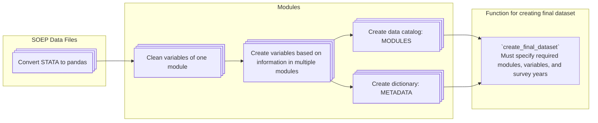

# soep-preparation

Prepare German Socio-Economic Panel (SOEP-Core) survey data into typed, cleaned,
documented variables — for research and as inputs to
[GETTSIM](https://gettsim.readthedocs.io/en/stable/).

The pipeline casts each raw variable to an adequate dtype, converts SOEP missing codes to
`pd.NA`, reduces over-fine categories, combines related variables across modules into new
ones, and exposes a metadata catalogue plus a helper for assembling a final dataset. The
raw data is the SOEP-Core panel from
[DIW Berlin](https://www.diw.de/en/diw_01.c.678568.en/research_data_center_soep.html).

## Where to go next

- [Getting started](getting_started.md) — install and run the pipeline.
- [Concepts](concepts.md) — waves, modules, SOEP file names, index variables, reference
  periods.
- [Scope](scope.md) — what the project does and does not do.
- [Creating a dataset](creating_a_dataset.md) — assemble variables with
  `create_final_dataset`.
- [Extending](extending.md) — add a variable, a derived variable, or a whole module.
- [Naming conventions](naming_conventions.md) — the German/English rule and reference
  periods.
- [Variables](variables.md) — the full catalogue of final variables.
